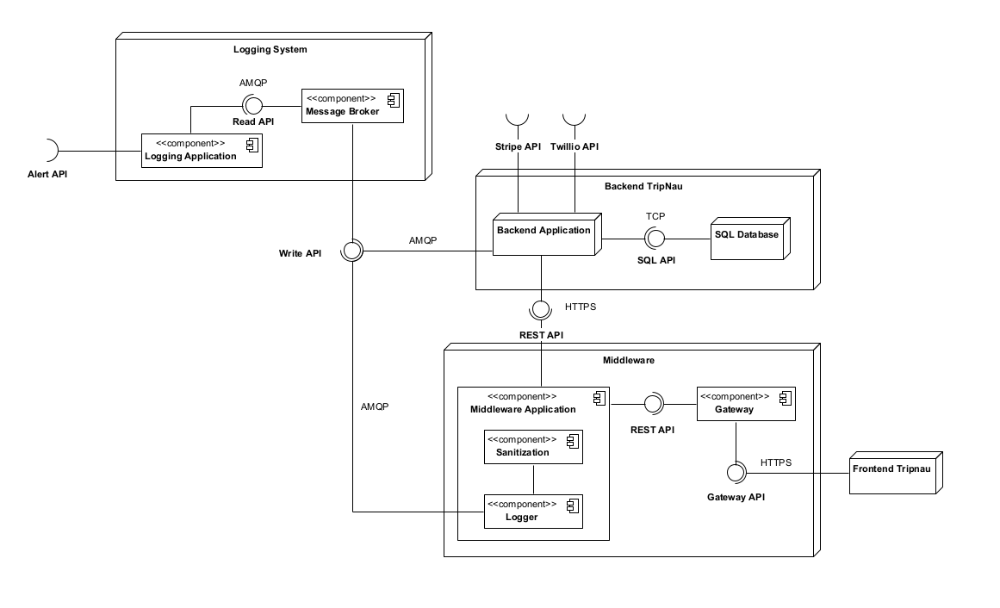

# DESOFS 2024 M1A Group 2 - Phase 1

### Members:
- 1190326 - Afonso Machado
- 1190535 - Domingos Machado
- 1230201 - Nuno Ribeiro
- 1230211 - Rui Neto
- 1230212 - Simão Santos

# 1. SSDLC

## 1.1 Analysis (Requirements gathering)

### 1.1.1 List of functional requirements

### 1.1.2 Use case and abuse case modeling

## 1.2 Design

### 1.2.1 System architecture

#### 1.2.1.1 Class diagram

#### 1.2.1.2 Components diagram

#### 1.2.1.3 Deployment diagram

Since this is a web site, the client-server architecture was adopted, and in order to relieve the processing load on the Backend, acting as a gateway, a Middleware component was created that is responsible for filtering out requests that should not reach the Backend, e.g. requests for authenticate routes that carry invalid tokens. In addition, the Middleware component is also responsible for sanitizing and validating the payloads of the requests on a technical level, e.g. ensuring that strings meet the minimum size or that requests with excessively large strings do not reach the Backend. 

The Backend, in turn, will be responsible for carrying out all the validation at business level. This component will only accept requests from Midleware and will therefore ignore all requests from other sources. The database that the Backend communicates with is hidden from the outside world, being on a private network. This component is also responsible for communicating with two external APIs in order to fulfill the necessary business flows, in this case the Stripe API and the Twillio API.

Finally, there is the Logs component, which is included in the entire system, as it is responsible for receiving all the actions carried out in the system and thus recording everything according to a standard. In order not to block any part of the system, a message broker was added to the communication, so that actions can be written and read asynchronously.

#### 1.2.1.4 Justification of the adopted Design Patterns

#### 1.2.1.5 Justification of the adopted Security Principles

### 1.2.2 Threat model (Software-Centric approach)

#### 1.2.2.1 Application decomposition

##### 1.2.2.1.1 Threat Model Information

**Application Version**: 1.0

This website is designed for the travel sector, focusing on facilitating the purchase of stays from customer to customer, emphasizing a peer-to-peer C2C model while excluding commercial entities in this first implementation. The platform supports three distinct user roles:

- Customer
- Property Owners
- System Admins

Property owners will be able to login and have access to features that allows them to register a new property and view the booking history for their listings. Users, on the other hand, can browse through a list of available properties without login, but will be able to login and initiate booking processes, and provide feedback through reviews. System admins will be able to login and play a role in approving reviews and managing the properties submitted to the platform.

##### 1.2.2.1.2 External dependencies

##### 1.2.2.1.3 Entry points

<table>
  <tr>
    <th>ID</th>
    <th>Name</th>
    <th>Description</th>
    <th>Trust Levels</th>
  </tr>
  <tr>
    <td>1</td>
    <td>HTTPS Port</td>
    <td>The booking website will only be accessible via TLS. All pages within the website are layered on this entry point.</td>
    <td>(1) Anonymous Web User, (2) Customer, (3) Property Owner, (4) Business admin</td>
  </tr>
  <tr>
    <td>1.1</td>
    <td>Website home page</td>
    <td>The splash page for the booking website is the entry point for all users.</td>
    <td>(1) Anonymous Web User, (2) Customer, (3) Property Owner, (4) Business admin</td>
  </tr>
  <tr>
    <td>1.2</td>
    <td>Login Page</td>
    <td>Customers, property owners and business admins must log in to the booking website before they can carry out any of the use cases.</td>
    <td>(1) Anonymous Web User, (2) Customer, (3) Property Owner, (4) Business admin</td>
  </tr>
  <tr>
    <td>1.2.1</td>
    <td>Login Function</td>
    <td>The login function accepts user supplied credentials and compares them with those in the database.</td>
    <td>(1) Anonymous Web User, (2) Customer, (3) Property Owner, (4) Business admin</td>
  </tr>
  <tr>
    <td>1.2.1.1</td>
    <td>Two factor authentication Function</td>
    <td>The two factor authentication function accepts user information and guarantee that is correct.</td>
    <td>(2) Customer, (3) Property Owner, (4) Business admin</td>
  </tr>
  <tr>
    <td>1.2.2</td>
    <td>Reset password function</td>
    <td>The reset function accepts all users, since they provide a valid email.</td>
    <td>(1) Anonymous Web User, (2) Customer, (3) Property Owner, (4) Business admin</td>
  </tr>
  <tr>
    <td>1.3</td>
    <td>Signup Page</td>
    <td>Customers and properties owners that don't have credentials must register in order to realize the login.</td>
    <td>(1) Anonymous Web User, (2) Customer, (3) Property Owner, (4) Business admin</td>
  </tr>
  <tr>
    <td>1.3.1</td>
    <td>Signup function</td>
    <td>The signup function accepts any registration data and guarantee that is a valid account before creating a new user.</td>
    <td>(1) Anonymous Web User</td>
  </tr>
  <tr>
    <td>1.4</td>
    <td>Properties entry page</td>
    <td>The page used to visualize properties.</td>
    <td>(2) Customer, (3) Property Owner, (4) Business admin</td>
  </tr>
  <tr>
    <td>1.4.1</td>
    <td>Property search function</td>
    <td>The page used to search for properties.</td>
    <td>(2) Customer, (3) Property Owner, (4) Business admin</td>
  </tr>
  <tr>
    <td>1.5</td>
    <td>Property detail page</td>
    <td>The page used to specify detail information about the property.</td>
    <td>(2) Customer, (3) Property Owner, (4) Business admin</td>
  </tr>
  <tr>
    <td>1.5.1</td>
    <td>Book property function</td>
    <td>The book function accepts the user information and guarantees that all the information is valid and correct.</td>
    <td>(2) Customer</td>
  </tr>
  <tr>
    <td>1.6</td>
    <td>Own bookings page</td>
    <td>The page used by customers to see their bookings.</td>
    <td>(2) Customer</td>
  </tr>
  <tr>
    <td>1.6.1</td>
    <td>Write property's review function</td>
    <td>The write property's review function accepts the review information and guarantees that all the information is valid and correct.</td>
    <td>(2) Customer</td>
  </tr>
  <tr>
    <td>1.7</td>
    <td>Own property list page</td>
    <td>The page used to list the properties owned by a property owner.</td>
    <td>(3) Property Owner</td>
  </tr>
  <tr>
    <td>1.7.1</td>
    <td>Create new property function</td>
    <td>The create new property function accepts the property input and validates in order to guarantee that is valid.</td>
    <td>(3) Property Owner</td>
  </tr>
  <tr>
    <td>1.7.2</td>
    <td>Delete a property function</td>
    <td>The delete a property function a property as input and verify if exists in the database.</td>
    <td>(3) Property Owner</td>
  </tr>
  <tr>
    <td>1.8</td>
    <td>Pending review list page</td>
    <td>The page where is possible to see the pending reviews.</td>
    <td>(4) Business admin</td>
  </tr>
  <tr>
    <td>1.8.1</td>
    <td>Approve/Reject review function</td>
    <td>The approve/reject review function takes information about one review and verify if exists in the database.</td>
    <td>(4) Business admin</td>
  </tr>
</table>

##### 1.2.2.1.4 Exit points

##### 1.2.2.1.5 Assets

##### 1.2.2.1.6 Trust Levels

<table>
  <tr>
    <th>ID</th>
    <th>Name</th>
    <th>Description</th>
  </tr>
  <tr>
    <td>1</td>
    <td>Anonymous web user</td>
    <td>A user that has connected to the website but hasn't provided credentials.</td>
  </tr>
  <tr>
    <td>2</td>
    <td>Customer</td>
    <td>The customer can see the booking list, see their personal information, and book a stay. Also, they can submit reviews of bookings that they stayed.</td>
  </tr>
  <tr>  
    <td>3</td>
    <td>Property owner</td>
    <td>A property owner can register a new property to be booked, see their personal information and see the bookings that are associated with their properties.</td>
  </tr>
  <tr>  
    <td>4</td>
    <td>Business administrator</td>
    <td>The business admin can approve or reject reviews sent by users, as the properties sent by the properties owners.</td>
  </tr>
  <tr>  
    <td>5</td>
    <td>Backend user process</td>
    <td>This is the user responsible for the backend process execution.</td>
  </tr>
  <tr>  
    <td>6</td>
    <td>Middleware server user process</td>
    <td>This is the user responsible for the middleware process execution.</td>
  </tr>
  <tr>  
    <td>7</td>
    <td>Logger administrator</td>
    <td>The administrator can analyze the logs and be notified of alerts originated by the log system.</td>
  </tr>
    <tr>  
    <td>8</td>
    <td>Message queue read user</td>
    <td>The user only has access to dequeue messages.</td>
  </tr>
    <tr>  
    <td>9</td>
    <td>Message queue write user</td>
    <td>The user only has access to enqueue messages.</td>
  </tr>
  </tr>
    <tr>  
    <td>10</td>
    <td>DB read user</td>
    <td>The user only has access to read queries.</td>
  </tr>
    <tr>  
    <td>11</td>
    <td>DB write user</td>
    <td>The user only has access to write queries.</td>
  </tr>
  </tr>
    <tr>  
    <td>12</td>
    <td>DB user admin</td>
    <td>The user that has permissions to administrate the database.</td>
  </tr>
</table>

##### 1.2.2.1.7 Data Flow Diagrams

#### 1.2.2.2 Rank and determination of threats

##### 1.2.2.2.1 Threat Categorization (STRIDE)

##### 1.2.2.2.2 Threat Analysis

- Attack Trees
- Abuse cases

##### 1.2.2.2.3 Ranking of Threats

##### 1.2.2.2.4 Qualitative Risk Model

#### 1.2.2.3 Countermeasures and Mitigation
