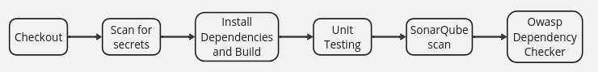
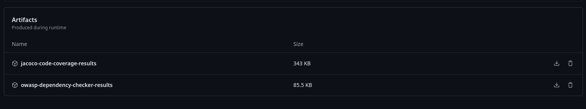
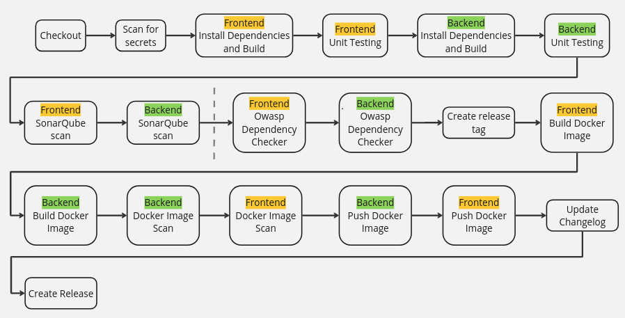
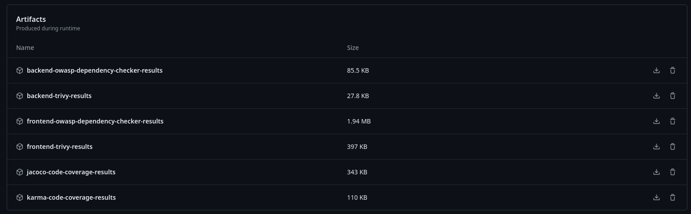

# DESOFS 2024 M1A Group 2 - Phase 2

### Members

- 1190326 - Afonso Machado
- 1190535 - Domingos Machado
- 1230201 - Nuno Ribeiro
- 1230211 - Rui Neto
- 1230212 - Simão Santos
  
# Index

- [Frontend](#frontend)
  - [Components](#components)
    - [Register](#register)
    - [Login](#login)
  - [Home](#home)
  - [Booking](#booking)
  - [Interceptors](#interceptors)
  - [Guards](#guards)
  - [Tests](#tests)
- [Backend](#backend)
  - [DDD, Immutability, DTOs](#ddd-immutability-dtos)
  - [JWT and Statelessness](#jwt-and-statelessness)
  - [Encryption](#encryption)
  - [Security Chain](#security-chain)
  - [SQL query parameterization](#sql-query-parameterization)
  - [Validations](#validations)
  - [Tests](#tests-1)
  - [Controller Advisor](#controller-advisor)
- [DevSecOps](#devsecops)
  - [Pipelines](#pipelines)
  - [Dependabot](#dependabot)
  - [Security Policy](#security-policy)

## Frontend 

Although the frontend addresses some of the security aspects in  the application, these can be easily surpassed as a UI is not required to communicate with the server. The frontend was designed in a way that it will handle user interactions and minimize the wrong interactions one might have with the application, however it isn't sufficient a safeguard for the application. In this section of the report, we talk about the components of the frontend and their functionalities, angling more on the security aspects of them.

### Components

#### Register

When a user is registering in the application, he is required to give the basic information about himself, including name, email and intended role.
The email given by the user is positively validated with the RegEx present in the OWASP validation RegEx repository <https://owasp.org/www-community/OWASP_Validation_Regex_Repository>

```ts
const EMAIL_REGEXP = /^[a-zA-Z0-9_+&*-]+(?:\.[a-zA-Z0-9_+&*-]+)*@(?:[a-zA-Z0-9-]+\.)+[a-zA-Z]{2,}$/;

if (!EMAIL_REGEXP.test(this.form.controls.email.value!)) {
    this.form.controls.email.setErrors({ email: true })
    valid = false;
}
```

The user is also required to insert a password that follows the minimum requirements by OWASP taken from the same repository.

```ts
this.passwordRequirements = [
    { requirement: 'At least 12 characters long', fulfilled: false },
    { requirement: 'Less than 128 characters long', fulfilled: false },
    { requirement: 'Contains at least one lowercase letter', fulfilled: false },
    { requirement: 'Contains at least one uppercase letter', fulfilled: false },
    { requirement: 'Contains at least one digit', fulfilled: false },
    { requirement: 'Contains at least one special character', fulfilled: false },
    { requirement: 'No more than 2 equal characters in a row', fulfilled: false }
];

checkPasswordRequirements(password: string): void {
    this.passwordRequirements[0].fulfilled = password.length >= 12;
    this.passwordRequirements[1].fulfilled = password.length < 128;
    this.passwordRequirements[2].fulfilled = /[a-z]/.test(password);
    this.passwordRequirements[3].fulfilled = /[A-Z]/.test(password);
    this.passwordRequirements[4].fulfilled = /\d/.test(password);
    this.passwordRequirements[5].fulfilled = /[!@#$%^&*]/.test(password);
    this.passwordRequirements[6].fulfilled = !/(.)\1{2,}/.test(password);
  }
```

The password is validated to make sure it has at least 12 characters and doesn't exceed 128. It is also required to have at least one special character, one upper case character, one lower case character and one digit. It also can't have more two characters in a row.

#### Login

When a user tries to log into the application, the e-mail is also positively validated the same way as when registering.
As a way to prevent brute-force attacks from the front-end, the user is timed-out in an exponential manner, ranging from 30 seconds after failing the loggin 3 times, and a full hour whenever the user fails to login 15 or more times.

```ts
const timeouts: number[] = [30 * 1000, 60 * 1000, 300 * 1000, 900 * 1000, 3600 * 1000];
const timeoutsStrings: string[] = ['30  seconds', '1 minute', '5 minutes', '15 minutes', '1 hour']

function handleLoginResponse(response: LoginResponse) {
    if (response.token) {
      this.router.navigateByUrl('/home');
    } else {
      this.failedAttempts += 1;
      if (this.failedAttempts === 3) {
        this.disabled = true;
        if (this.totalFailedAttempts < this.timeouts.length) {
          this.timeout = this.timeouts[this.totalFailedAttempts]
          this.timeoutString = this.timeoutsStrings[this.totalFailedAttempts]
        } else {
          this.timeout = this.timeouts[this.timeouts.length - 1]
          this.timeoutString = this.timeoutsStrings[this.timeoutsStrings.length - 1]
        }
        setTimeout(() => {
          this.form.setErrors({ tooManyFailures: true })
          this.disabled = false;
        }, this.timeouts[this.totalFailedAttempts])
        this.failedAttempts = 0;
        this.totalFailedAttempts++;
      } else {
        this.form.setErrors({ invalidCredentials: true })
      }
    }
  }
```

The login request is sent by the authentication service who then handles the response and parses the JWT token that comes in the headers.

```ts
function login(credentials: LoginRequest): Observable<LoginResponse> {
    return this.http.post<LoginResponse>(environment.apiUrl + '/auth' + ROUTE.LOGIN, credentials, { observe: 'response' }).pipe(
      map((response: HttpResponse<LoginResponse>) => {
        if (response.headers.get('Authorization')) {
          this.setToken(response.headers.get('Authorization')!)
        }
        return response.body!;
      })
    )
  }
```

Whenever a login is successful, the application stores the token in the authentication service service and in the browsers local storage, in the case of the user not being an administrator. The token saved in the local storage is to allow for a user to close the tab and re-open it while still keeping it's logged in status as the application checks for tokens in the local storage on boot, however this would be a security breach in the case of a user with admin credentials and therefore the token isn't stored in such cases.

```ts
ngOnInit(): void {
    if (localStorage.getItem('token')) {
      this.authService.setToken(localStorage.getItem('token')!);
    }
    this.messagesService.getMessages().subscribe((message) => this.messageService.add(message))
  }
```

### Home

The landing page of the application. After a user authenticates they get access to a list of the properties they have available to rent as well as some information about them such as location, cost, etc.
This page is meant as a hub for most functionalities of the application. It also works as a return for most of the other applications when they conclude and therefore it's routing is intertwined with authenticationguards, restricting what each user is allowed to do.

### Booking

When a user clicks on a property to rent they're taken to a page containing the option to rent a property for an interval of time. This page follows the same information model as the home page allowing for a request to the database to be skipped.
When trying to rent a property the user is required to insert valid dates and in the future a guest list might be required, otherwise a request to the back-end will not be sent.
When a valid booking is generated, the back-end validates the information as well as the validity of the selected dates. In the future the user might be alerted as to what dates are valid.
This prevents abuse of the requests on a first level, as well as prevents a user overriding another's booked stay.
All these actions are also guarded by authentication.

### Interceptors

Interceptors in Angular are functions that act on the request chain, acting between the HttpClient and the HttpBackend and are able to interact with the request sent in order to perform actions that should be performed on all requests. This is a functionality that eases the addition of Security headers to the requests being sent, and can also be used to sanitize the requests information and to limit the amount of requests being sent.

In this interaction the interceptors implemented were the rate limiting interceptor and the authentication interceptor.
The authentication interceptor communicates with the authentication service and for every request checks if the user is authenticated in which case it will add the user name to the headers of the request along with with the token. This interceptor also adds some other headers to prevent the caching of information like Pragma and Cache-Control.

```ts
export const authInterceptor: HttpInterceptorFn = (req, next) => {
  const authService = inject(AuthService)

  const appendHeaderIfMissing = (headers: HttpHeaders, header: string, value: string): HttpHeaders => {
    if (headers.has(header)) return headers
    return headers.append(header, value);
  }

  let headers = req.headers;

  headers = appendHeaderIfMissing(headers, 'Pragma', 'no-cache')
  headers = appendHeaderIfMissing(headers, 'Cache-Control', 'no-cache')

  if (authService.getUser()) {
    headers = appendHeaderIfMissing(headers, 'user', authService.getUser()!);
  }
  if (authService.getToken()) {
    headers = appendHeaderIfMissing(headers, 'Authorization', 'Bearer ' + authService.getToken())
  }

  return next(req.clone({ headers }));
};
```

The rate limiting interceptor works in a similar way to the Token Bucket Algorithm, where each request sent will cost a token from the "bucket" and these tokens are refilled after X amount of time, inspired by the article from Hiresh Trivedi on Designing a Distributed Rate Limiter <https://medium.com/wineofbits/designing-a-distributed-rate-limiter-deep-dive-76d7e8d8452d>.

This interceptor will be the first to be triggered in the interceptor chain and will act as a safeguard against the overuse of the server. It will try to consume one token from the service (up to a maximum of 60 per minute) and in the case where it can, the request can proceed, whereas in the opposite case an exception will be returned to inform the user that he needs to chill.

```ts
export const rateLimitingInterceptor: HttpInterceptorFn = (req: HttpRequest<any>, next: HttpHandlerFn) => {
  const service = inject(RateLimitingService)
  if (service.tryConsume()) {
    return next(req);
  } else {
    return new Observable<HttpResponse<any>>(observer => {
      observer.error(new HttpResponse({
        status: 429,
        statusText: 'Too Many Requests',
        body: { error: 'Rate Limit Exceeded' }
      }));
    });
  }
};
```

### Guards

A guard is the component responsible for safeguarding certain routes of the application according to some conditions. In our case, we used an authentication guard that would validate if the user is authenticated and then check if the role that the user has is in the list of required roles to access that route. Whenever a user isn't authenticated he is routed to the login page, and if he doesn't have permissions to access the route he tried to access the route will return false and he will stay in the same page.

```ts
export function authGuard(requiredRoles: Array<string>) {
  const guard: CanActivateFn = () => {
    const authService = inject(AuthService);
    const router = inject(Router)

    if (!authService.isAuthenticated()) {
      router.navigateByUrl('/login')
      return false;
    }

    if (requiredRoles.length == 0) return true;
    const roles = authService.getRoles();
    let authorizide = false;
    
    requiredRoles.forEach((role) => {
      if (roles.includes(role)) authorizide = true
    })

    return authorizide;
  };
  return guard;
}
```

### Tests

The testing of the application is also a crucial part in ensuring the functionality and security of the whole. However due to time constraints, not all features were properly tested as the main focus for this iteration was the adoption of a pipeline that is fully functional. For this reason, the tests were more focused on security related functionalities like the rate limiting interceptor and auth interceptor.

## Backend

### DDD, Immutability, DTOs

The decision was made to employ the DDD pattern for domain modeling, considering the benefits it offers in safeguarding business logic. However, it's acknowledged that such approaches entail some drawbacks, such as increased computational overhead in mapper execution. Nonetheless, they bring significant advantages by ensuring a clear separation of concerns and promoting a more maintainable and scalable architecture. With that it was preserve the immutability along all the project to guarantee a more secure way to communicate and work with objects from all project.

In the communications aspect, the transfer of DTOs has been stipulated to ensure that only strictly necessary data is transmitted, providing greater control and security in transactions. Thus, it is possible to work with complete data internally, while externally only the essential is known.

### JWT and Statelessness

For authentication and authorization, **we decided to use JSON Web Token (JWT)**. JWT is a compact, URL-safe means for securely transmitting information, such as user information and token validity between our frontend and backend applications.

Our JWT consists of three parts: the header, the payload, and the signature. The header contains the signing algorithm used (RS256). The payload holds the claims, which are the user ID, the expiration date (created based on role), the email and the role. Lastly, the signature ensures that the token hasn't been altered. It's created by taking the encoded header and payload, along with a secret key, and hashing them together **using the algorithm specified in the header**.

JWTs are widely used in modern web applications due to their benefits, **such as enabling stateless authentication mechanisms**. Since the our tokens contain all necessary information about the user's session, there's no need to maintain session information server-side.

Our workflow involving JWT starts with the client sending authentication credentials to the server. Upon successful authentication, the server generates a JWT with the user information (id, email and role) and an expiration date, signs it, and sends it back to the client. The client then stores the token, and includes the JWT in the HTTP Authorization header using the Bearer schema for subsequent requests to protected resources defined in our `SecurityConfig` file. Our backend verifies the token's signature and checks its claims to ensure validity before granting access to the requested endpoint.

As we know the JWT tokens must be used securely to prevent vulnerabilities, the RSA keys were kept in the `.env` file.

### Encryption

Encrypting passwords was a critical aspect of securing our users data. By converting plain text passwords into a secure, unreadable format before storing them in a database, encryption enhances security by protecting passwords from unauthorized access.

Even if an attacker gains access to the database, the encrypted passwords **are not useful without the decryption key**, significantly reducing the risk of password theft. Our encrypted passwords ensure data integrity, as the original passwords cannot be altered or tampered with; any changes to the encrypted data would render it invalid when decrypted.

Encryption also mitigates the risk of various attacks, **such as brute-force and dictionary attacks**, by making passwords stored in an encrypted format far more resistant to these hacking techniques. In our  code, we use a `PasswordEncoder` interface from the `Spring Security` framework to encrypt user passwords before storing them in the database.

This happens in the `create` method of the `UserService` class, where the password is encoded using the `PasswordEncoder.encode` method before being saved.

### Security Chain

Given that the backend was developed using Spring Boot, it is a best practice to utilize well-established and tested libraries and frameworks that offer security and reliability, such as [Spring Security](https://spring.io/projects/spring-security).

Spring Security is a framework responsible for managing the authentication and access control processes, serving as the standard in this area for Spring-based applications. This framework operates through layers, where all requests received by the server are processed by different layers, each with a specific role, allowing for a customizable security chain.

For our application, Spring Security will be fundamental for handling authentication via JWT, configuring CORS, protecting against CSRF, and other security-related concerns. At a high level, Spring Security functions based on the reception and response to HTTP requests. Each request passes through a series of layers, each with distinct responsibilities. Depending on the outcome at each layer, the request either advances or is blocked by an exception.

**Filter chain**

For our case, we will need to use the `JwtAuthenticationFilter` to decode and process the token, managing authentication and authorization based on its contents. Additionally, we need to implement a `UsernamePasswordAuthenticationFilter` to authenticate users during their active sessions. It is also crucial to configure a routing mechanism to ensure that users making requests have the necessary authorization. Below, we describe the steps taken to ensure secure and authenticated communication:

To decode the JWT token, we created a filter responsible for extracting the token from the Authorization header and decoding it. This allows us to verify whether the user is communicating with a valid token and to determine their authorization level within the system. We established three levels of authorities: Business Admin, Property Owner, and Customer. For the encoding/decoder process we used the NimbusJwt library implementation that gives confidence given that the popularity. This process creates a `Authorization` object that caries out all the information about the user, like the username and the roles that user has.

With the user authenticated is now possible to do the routing where we say what are the authorities that we are allowing:

```java
      .requestMatchers(HttpMethod.GET, "/rental_property/{id}").permitAll()
      .requestMatchers(HttpMethod.POST, "/rental_property/create").hasAuthorit(Authority.PROPERTYOWNER)
      .requestMatchers(HttpMethod.GET, "/rental_property/allByUser/{id}").hasAnyAuthority(Authority.PROPERTYOWNER, Authority.BUSINESSADMIN)
```

Nonetheless, there is cases where exist the necessity to refine more the authorization scope, like in the case of, for example, deactivating a rental property, each can be done by the authority Property Owner and Admin, however we need to ensure that a only the real Property Owner can change their own property. For that, we work with the object `Authentication` that it was created on the JWT chain process to the controller and proceed the following logic:

```java

    @DeleteMapping("/{id}")
    public ResponseEntity<FetchRentalPropertyDto> delete(@PathVariable final String id,
                                                         final Authentication authentication){

       ...

        String userId = authentication.getName();
        FetchRentalPropertyDto rentalProperty = this.rentalPropertyService.findById(id);

        if (!rentalProperty.getPropertyOwner().equals(userId) && !hasAuthorization(authentication, Authority.BUSINESSADMIN)) {
            throw new NotAuthorizedException("The request user is not the owner of rental property.");
        }

      ...
    }
```

Given the time constraints, it was not possible to robustly configure CORS and CSRF protections. However, this will be addressed in the next development phase. For the CORS configuration, we need to block interactions from unknown origins. This will require further elaboration of the existing configuration, which is currently open to all origins, like shown bellow:

```java
    @Bean
    public CorsConfigurationSource corsFilter() {
        final UrlBasedCorsConfigurationSource source = new UrlBasedCorsConfigurationSource();
        final CorsConfiguration config = new CorsConfiguration();
        config.setAllowCredentials(true);
        config.addAllowedOrigin("*");
        config.addAllowedHeader("*");
        config.addAllowedMethod("*");
        source.registerCorsConfiguration("/**", config);
        return source;
    }
```

For the CSRF a good practice cited by the Spring Security is the utilization of the [Synchronizer Token Pattern](https://cheatsheetseries.owasp.org/cheatsheets/Cross-Site_Request_Forgery_Prevention_Cheat_Sheet.html#synchronizer-token-pattern), that is scheduling to be done in the second milestone.

### SQL query parameterization

Given that Injection vulnerabilities are highlighted by the OWASP Top 10 Risks, it is crucial to focus on preventing SQL Injection. To address this, we used a robust and well-known ORM like JPA. However, it is essential to ensure that we are following the correct patterns for parameterization, as proposed by the [OWASP SQL Injection Prevention Cheat Sheet](https://cheatsheetseries.owasp.org/cheatsheets/SQL_Injection_Prevention_Cheat_Sheet.html). To accomplish this, we ensure that all queries use parameters and none of them use plain text Query API Builders, like shown bellow with the use of `:parameter`:

```java
    @Query("SELECT pni FROM price_night_interval pni WHERE pni.rentalPropertyId=:rentalPropertyId")
    List<PriceNightIntervalDB> findByRentalPropertyId(String rentalPropertyId);
```

### Validations

When it comes to validating user input, `Spring Boot` provides strong support for this common, yet critical, task straight out of the box. Those validations were essential for ensuring that the data provided by the user to our backend application met specific criteria before processing. Spring Boot leverages `Bean Validation`, a powerful and flexible framework, to facilitate this. Bean Validation, which is part of the Java EE and Jakarta EE platforms, **allowed us to annotate our domain model with constraints and validation rules**.

Just as an example, we used the `@Email` and `@NotNull` annotations in the `email` input that - this criteria is ensured by the `@Valid` annotation in the `AuthController`.

### Tests

Testing the software is a crucial part of ensuring security. To achieve this, we created unit tests focusing on the domain objects to guarantee that all domain logic is correct and, also, that exceptions are thrown as expected. Our design ensures that the domain and services fail gracefully by throwing exceptions, which are then handled by a ControllerAdvisor to catch all exceptions effectively.

Another important aspect is integration testing, which ensures that all parts of the system work well together. Although this was not completed in the first milestone due to time constraints, it is scheduled for the second milestone. For this phase, we plan to use [TestContainers](https://testcontainers.com/) to support database containers, and use mock framework with the logic of mocking the controller.

### Controller Advisor

One critical aspect for secure and reliable applications is handling exceptions in a manner that prevents sensitive information from being exposed to potential attackers. Exposing detailed error messages, such as SQL exceptions or stack traces, **can provide attackers with valuable information about the system's internals**, which they can exploit to find vulnerabilities and launch attacks. By abstracting error messages, **we mitigate this risk**, providing a more secure environment.

To address this issue, we implemented a global exception handler in our Spring Boot application. This handler ensures that detailed error information is logged internally while only generic messages are exposed to end-users.

Additionally, this method improves the user experience by presenting clear, user-friendly error messages rather than technical jargon or detailed error stacks, **which can be confusing and frustrating for users**. It also simplifies the maintenance of the application by centralizing exception handling, allowing developers to manage all exceptions in a single place, ensuring consistent error responses and making the codebase cleaner and easier to understand.

The implementation involves a `ControllerAdvisor` class annotated with `@ControllerAdvice`. This class includes methods to handle various types of exceptions, such as `MethodArgumentNotValidException`, `NotFoundException`, `BadCredentialsException`, `NotAuthorizedException`, and general exceptions. For each exception type, a corresponding method constructs an `ErrorPayloadMessage` object, which contains the timestamp, status, error type, message, and request path.

The `ControllerAdvisor` class uses methods to extract the request path, create error payloads, and format error messages. Specific `@ExceptionHandler` methods handle different types of exceptions, returning appropriate HTTP statuses and generic messages.

## DevSecOps

### Pipelines 

This section focuses on how to integrate DevSecOps practices into CI/CD pipelines using GitHub Actions. The pipelines focus on planning, building, testing and deploying both frontend and backend applications, with an emphasis on security and quality.

The pipelines include stages for:

- **Scanning for secrets**: Ensures no sensitive data is exposed.
- **Static Application Security Testing (SAST)**: Uses SonarQube to identify security vulnerabilities in the code.
- **Software Composition Analysis (SCA)**: Utilizes OWASP Dependency Check to analyze project dependencies for known vulnerabilities.
- **Container Analysis**: Uses Trivy to scan Docker images for vulnerabilities.

The conditions for code quality include:

**Conditions on New Code**

- Duplicated Lines (%): Must be less than 3.0%
- Maintainability Rating: Must be A
- Reliability Rating: Must be A
- Security Hotspots Reviewed: Must be 100%
- Security Rating: Must be A

**Conditions on Overall Code**

- Blocker Issues: Must be less than 2
- Coverage: Must be more than 10.0% 
(Currently, due to time constraints, we have prioritized pipeline development and other software components over extensive testing)
- Critical Issues: Must be less than 2

There are three different pipelines (workflows): 

**Frontend Workflow** - Triggered when changes are made to the frontend codebase. Specifically, when a pull request (PR) to the dev branch is opened, this pipeline runs on the source branch of the PR. After the merge, the pipeline runs again on the dev branch.

**Backend Workflow** - Similar to the frontend workflow, this is triggered when changes are made to the backend codebase. It runs on the source branch when a PR to the dev branch is opened and again on the dev branch after the merge.

The following image displays the jobs of the previous described workflows.



*Backend artifacts*



*Frontend artifacts*


**Release Workflow** - Triggered when changes are made to either the backend or frontend. This pipeline executes when a PR targeting the master branch is opened. Initially, it runs up to a certain point (indicated by the dotted line in the diagram) on the source branch of the PR. After the merge, the full pipeline runs on the master branch. This workflow also updates the changelog and creates a new release.



After executing the release pipeline, the following artifacts are produced:



### Dependabot

Dependabot, a GitHub tool, is dedicated to helping with the management and updating of project dependencies automatically. Its purpose is to ensure project security and currency by regularly checking for vulnerabilities and new dependency versions. For this project, Dependabot has been set up to run weekly for both the frontend and backend, utilizing npm for the frontend and Maven for the backend. It manages tasks such as: Dependabot Alerts, Dependabot Security Updates and Dependabot Version Updates.

### Security Policy

In order to ensure the safety and integrity of our software, a comprehensive security policy has been established. This policy serves as a vital resource for users, providing clear guidelines on how to effectively report any vulnerabilities they may discover within our system.

To provide users with clear guidance on reporting discovered vulnerabilities, our security policy is documented in the `SECURITY.md` file. The security policy aims to foster a proactive approach towards identifying and addressing potential security threats. It outlines the necessary steps for users to follow when reporting vulnerabilities.

---